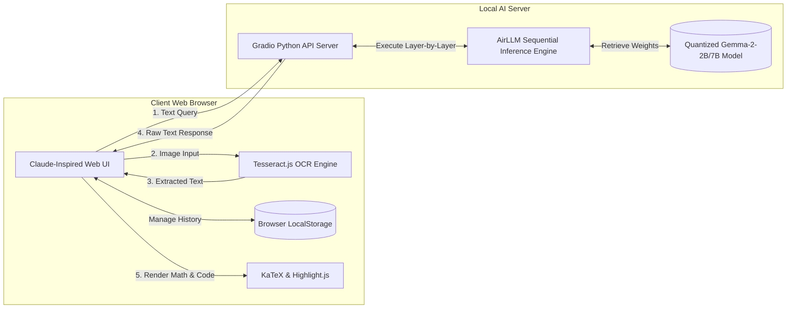
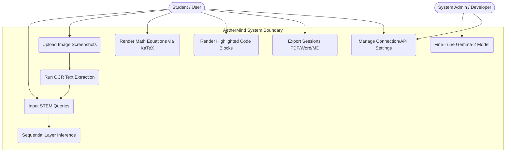
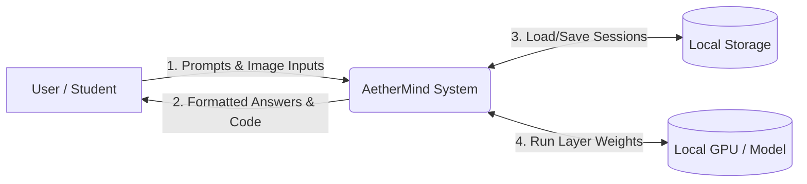
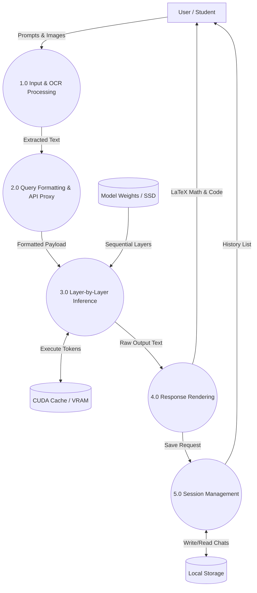
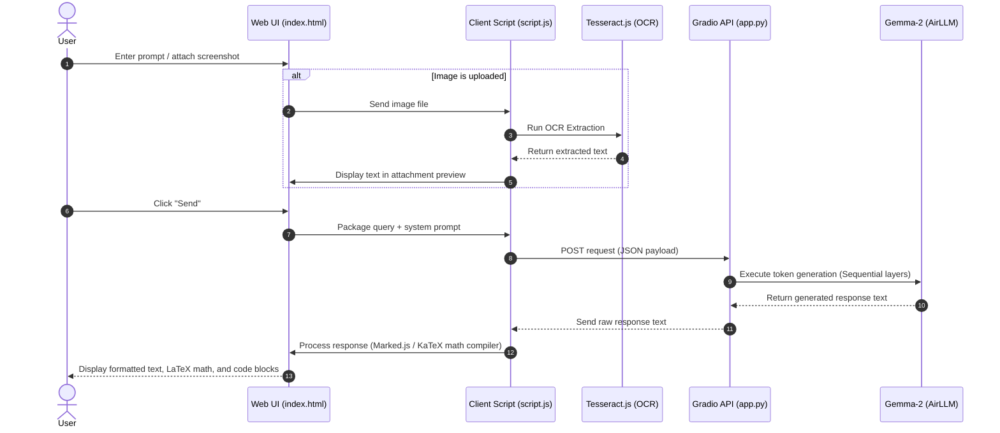
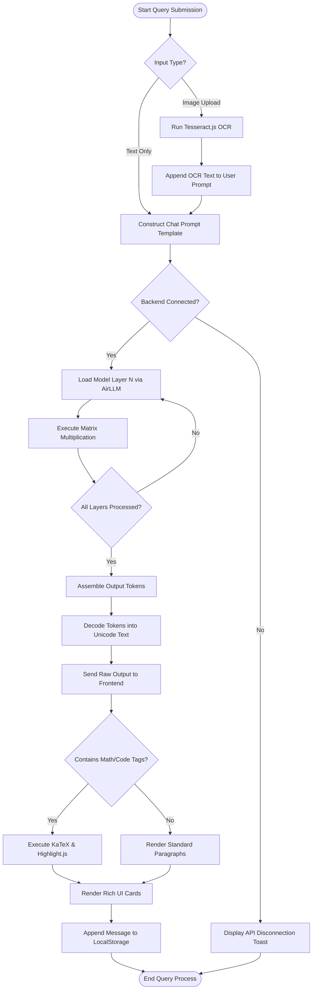

# SOFTWARE REQUIREMENTS SPECIFICATION (SRS)
## PROJECT STUDY & SYSTEM DESIGN

**PROJECT NAME:** AetherMind  
**SYSTEM TYPE:** Local-First Computational AI Tutor and Coding Assistant  
**TEAM MEMBERS:**  
1. L DHANUSH RAJ (Reg No: [Insert Reg No])  
2. SHREYAS V (Reg No: [Insert Reg No])  
3. HARISH MEHALA KUMAR (Reg No: [Insert Reg No])  
**DEPARTMENT:** Computer Science and Engineering  

---

## 1. INTRODUCTION

### 1.1 Purpose
This Software Requirements Specification (SRS) document defines the system architecture, modules, functional behaviors, non-functional constraints, and technical configurations of the **AetherMind** project. The document is prepared to outline both the system-level interactions (such as local model inference, dataset processing, and UI updates) and user-level interfaces. It acts as a blueprint for the design, development, testing, and deployment of AetherMind.

### 1.2 Scope
AetherMind is an offline-first, fine-tuned conversational assistant specializing in mathematics, statistics, computer science, programming, web development, and cybersecurity. 
*   **Included:** Fine-tuning base Gemma-2-2B/7B models using QLoRA; local sequential execution via AirLLM to save VRAM; a responsive, browser-based web dashboard (HTML/CSS/JS) with KaTeX math rendering, syntax highlighting, Tesseract.js OCR, and database integration; history persistence in localStorage.
*   **Excluded:** Training LLMs from scratch (pre-training); enterprise-scale multi-GPU distributed serving; support for non-STEM domains (such as humanities or literature tutoring, where the fine-tuned model does not specialize).

### 1.3 Definitions, Acronyms, and Abbreviations
*   **SRS:** Software Requirements Specification
*   **LLM:** Large Language Model
*   **SLM:** Small Language Model (typically < 10 billion parameters)
*   **QLoRA:** Quantized Low-Rank Adaptation (a parameter-efficient fine-tuning technique)
*   **PEFT:** Parameter-Efficient Fine-Tuning
*   **VRAM:** Video Random-Access Memory (GPU Memory)
*   **OCR:** Optical Character Recognition
*   **API:** Application Programming Interface
*   **DFD:** Data Flow Diagram
*   **KaTeX:** High-speed math typesetting library for the web

---

## 2. PROJECT STUDY: EXISTING VS. PROPOSED SYSTEM

```
+-------------------------------------------------------------------------+
|                              SYSTEM COMPARISON                          |
+------------------------------------+------------------------------------+
|          EXISTING SYSTEM           |          PROPOSED SYSTEM           |
|  (Cloud-based Generalist LLMs)    |        (AetherMind Local STEM)     |
+------------------------------------+------------------------------------+
| * Constant Internet Required       | * Local & Offline Execution        |
| * Generic / High Hallucinations    | * Fine-Tuned STEM Specialization   |
| * High Token / API Costs           | * Zero Operational Cost            |
| * Data Uploaded to Cloud Servers   | * Full Privacy & Local Data        |
| * Basic Markdown Rendering         | * Advanced Math & Code Formatting  |
+------------------------------------+------------------------------------+
```

### 2.1 Existing System
The existing ecosystem of computational and educational tools consists of:
1.  **General-Purpose Cloud LLMs:** Commercial models (ChatGPT, Gemini, Claude) that process user inputs on remote servers.
2.  **Traditional Web Search Engines:** Platforms like Google or StackOverflow where users manually parse search results.
3.  **Conventional Tutoring Software:** Static learning management systems (LMS) with pre-recorded videos and multiple-choice questionnaires.

### 2.2 Limitations of the Existing System
*   **Lack of Specialized Math/STEM Reasoning:** General-purpose cloud LLMs are trained on wide-ranging internet text. They often hallucinate basic algebraic steps, fail to maintain equation consistency, or output buggy code because they lack targeted fine-tuning on rigorous computational proofs.
*   **Heavy Resource and API Costs:** Running proprietary LLMs incurs high monthly subscription fees or token usage costs ($20/month per user or usage-based pricing), which is unaffordable for students.
*   **Privacy and Data Leakage Risks:** Users are forced to upload personal queries, research scripts, and proprietary codebases to corporate cloud servers, risking data leakage and violating intellectual property standards.
*   **Dependency on High-Speed Internet:** If the network connection is weak or disconnected, cloud-based assistants become completely non-functional, preventing offline study or coding.
*   **Suboptimal Visual Formatting:** Browser interfaces often display code in flat blocks and mathematical notations as unreadable plain text (e.g., `x^2 + \sqrt{y}`) instead of beautifully rendered textbook formulas.

### 2.3 Proposed System
**AetherMind** is an offline-first, domain-specialized AI assistant designed to solve these limitations. It consists of:
1.  **A Fine-Tuned Small Language Model Core:** Built on Gemma-2-2B/7B using Unsloth (QLoRA) and trained on a custom mathematical, algorithmic, and coding dataset. It delivers structured, step-by-step proofs, formulas, and verified code templates.
2.  **Low-Resource Local Inference Backend:** Uses AirLLM to load model layers sequentially into memory, allowing a high-capability 7B model to run on a consumer-grade laptop with only 4GB–8GB of VRAM.
3.  **An Elite Browser Web UI:** A local, responsive frontend featuring a modern UI with dark/light modes, particle backgrounds, and real-time Math/Code parsing (KaTeX & Highlight.js). It supports OCR via Tesseract.js to analyze screenshot uploads and exports sessions to PDF, MS Word, or Markdown files.

### 2.4 Benefits of the Proposed System
*   **High Mathematical & Logical Accuracy:** The specialized fine-tuning ensures the model follows rigorous scientific formats, providing step-by-step explanations, showing calculations, and verifying logic.
*   **100% Data Privacy & Offline Utility:** All model weights and chat inputs remain on the local machine. Computations occur locally, eliminating cloud leakage and allowing full operation without internet access.
*   **Zero Operational & Licensing Costs:** Once the model is compiled and stored on the device, there are no ongoing API calls, token fees, or subscription requirements.
*   **Premium Presentation Layer:** Equations are displayed in pristine math formatting ($...$ and $$...$$), and code blocks are fully syntax-highlighted with a copy button and file attachments.
*   **Flexible Client Integration:** The client web page can connect to any running Gradio backend, letting users separate their user interface from their resource-intensive model servers (e.g., running the model on a local workstation while chatting on a lightweight tablet).

---

## 3. CURRENT AND RECENT WORKS (LITERATURE SURVEY)

Recent developments in computational intelligence and LLM execution have centered around three main pillars:

### 3.1 Parameter-Efficient Fine-Tuning (PEFT & QLoRA)
Training billions of parameters requires massive multi-GPU setups. Hu et al. (2021) introduced **Low-Rank Adaptation (LoRA)**, which freezes the pre-trained model weights and injects trainable rank decomposition matrices into each layer, reducing the parameter count by up to 99%. Dettmers et al. (2023) advanced this with **QLoRA (Quantized LoRA)**, introducing 4-bit NormalFloat (NF4) quantization. QLoRA enables fine-tuning of 7B and 13B parameter models on a single consumer GPU (like an NVIDIA RTX 3060) without performance degradation. AetherMind utilizes QLoRA via the **Unsloth** library to achieve fast training convergence on Google Colab T4 hardware.

### 3.2 Quantization and Sequential Local Inference (AirLLM)
Executing LLMs locally is restricted by VRAM. Quantization techniques (like GGUF, AWQ, and GPTQ) reduce model weights from 16-bit to 4-bit, shrinking a 7B model from 14GB to ~4.5GB. However, even 4.5GB can cause Out-Of-Memory (OOM) errors on entry-level GPUs (2GB–4GB VRAM). Recent works, including the **AirLLM** project, introduce layer-by-layer sequential execution. Instead of loading the entire neural network into VRAM simultaneously, AirLLM loads and executes layers one at a time, offloading inactive layers to system RAM or SSD storage. This allows models up to 70B parameters to run on a single RTX 3050 GPU, establishing a viable foundation for local-first computing.

### 3.3 Specialized STEM Tutoring and Code Models
Traditional LLMs undergo reinforcement learning from human feedback (RLHF) to behave as general chat partners. However, this often dilutes their ability to solve precise scientific equations. Works like Google's **Gemma** and Meta's **Llama** series have shown that smaller, instruction-tuned models (2B–8B parameters) can outperform larger models on STEM and coding benchmarks if given high-quality, targeted datasets. AetherMind utilizes this approach by combining a specialized STEM dataset with Gemma-2's advanced attention architecture to deliver high-quality scientific tutoring.

### References
1.  Hu, E. J., Shen, Y., Wallis, P., Allen-Zhu, Z., Li, Y., Wang, S., Wang, L., & Chen, Weizhu. (2021). *LoRA: Low-Rank Adaptation of Large Language Models*. arXiv preprint arXiv:2106.09685.
2.  Dettmers, T., Pagnoni, A., Holtzman, A., & Zettlemoyer, L. (2023). *QLoRA: Efficient Finetuning of Quantized LLMs*. Conference on Neural Information Processing Systems (NeurIPS).
3.  Touvron, H., Martin, L., Stone, K., et al. (2023). *Llama 2: Open Foundation and Fine-Tuned Chat Models*. arXiv preprint arXiv:2307.09288.
4.  Gemma Team, Google DeepMind. (2024). *Gemma: Open Models Based on Gemini Research and Technology*. Technical Report.

---

## 4. FUNCTIONAL REQUIREMENTS

The functional requirements describe what functions the AetherMind software must perform, how it reacts to specific inputs, and its behavior in exceptional situations.

### 4.1 System Functions & Solutions
*   **FR-1: Conversational Chat Interface**
    *   *Input:* Text-based natural language queries (questions on math, code, algorithms).
    *   *Output:* Detailed, step-by-step explanations, math equations formatted in LaTeX, and source code written in the requested programming language.
*   **FR-2: Mathematical Formatting (KaTeX Engine)**
    *   *Input:* Output text from the model containing mathematical delimiters (e.g., `$$` or `$`).
    *   *Output:* Beautifully rendered math formulas in standard academic notation, compiled instantly on the client side.
*   **FR-3: Code Execution & Highlighting**
    *   *Input:* Code snippets enclosed in triple backticks (\`\`\`).
    *   *Output:* Code boxes featuring syntax highlighting, line numbers, language identification tags, and a copy-to-clipboard button.
*   **FR-4: OCR Document Processing**
    *   *Input:* User uploads an image file (PNG/JPEG) containing code or mathematical formulas.
    *   *Output:* Tesseract.js extracts the text content, displays it in the chat preview, and submits it to the model for explanation.
*   **FR-5: Chat Session Export**
    *   *Input:* User clicks on PDF, Word (DOC), or Markdown export options.
    *   *Output:* A downloadable file containing the formatted conversation history.
*   **FR-6: local Connection Settings**
    *   *Input:* User inputs a custom Gradio URL, Search API keys, or database credentials (Supabase).
    *   *Output:* The application stores these settings in `localStorage` and routes future queries through the configured API endpoint.

### 4.2 System Behavior under Exceptional Situations

| Incident ID | Exceptional Situation | System Reaction / Corrective Action |
| :--- | :--- | :--- |
| **EX-1** | Gradio API Backend Disconnected | Displays an error card: *"Connection Error: Ensure your Gradio server is running..."*. Disables the send button and stops the loading indicator to prevent interface freezing. |
| **EX-2** | Large File Upload | Blocks files larger than 10MB. Displays a warning toast message: *"File size exceeds 10MB limit. Please upload a compressed version."* |
| **EX-3** | Invalid File Format (e.g., ZIP, EXE) | Validates MIME type on upload. Rejects invalid files and shows a toast: *"Unsupported file format. Please upload text, markdown, or image files."* |
| **EX-4** | Local GPU Out-Of-Memory (OOM) | AirLLM raises an memory exception. The backend catches the exception, clears the PyTorch CUDA cache (`torch.cuda.empty_cache()`), and sends an error response to the client: *"System Memory Exceeded. Retrying with a lower token limit."* |
| **EX-5** | Empty Input Submission | The interface disables the send button if the text area is empty and no files are attached. If bypass occurs, the system ignores the request. |
| **EX-6** | Supabase Connection Failure | If cloud sync fails due to invalid credentials, the system falls back to saving chat history locally in the browser's `localStorage` and notifies the user via a status indicator. |

---

## 5. NON-FUNCTIONAL REQUIREMENTS

### 5.1 Performance
*   **Inference Latency:** Using AirLLM on a GTX 1660/RTX 3050 GPU, token generation should maintain a speed of at least 3-5 tokens/second.
*   **UI Load Time:** The web frontend (HTML/CSS/JS) must load and become interactive within 1.5 seconds.
*   **Math Rendering Speed:** KaTeX must compile and render equations on the screen in less than 100 milliseconds after receiving output.

### 5.2 Reliability
*   **Session Persistence:** If the user closes or refreshes the browser, all past conversations, settings, and file attachments must remain intact by reading from `localStorage`.
*   **Graceful Degradation:** If the GPU backend is offline, the frontend remains fully functional, allowing users to browse history, search previous chats, and export transcripts.

### 5.3 Usability
*   **Responsive Layout:** The design must adapt to all device screens (Mobile, Tablet, Desktop) using media queries.
*   **Accessibility:** Support light and dark modes to adjust to different lighting environments.
*   **Intuitive Controls:** Include single-click copy buttons for code, instant retry triggers, and clean navigation menus.

### 5.4 Security
*   **Data Isolation:** All conversation histories and extracted OCR texts must be stored locally on the client's device, with no external cloud servers accessed unless the user explicitly configures a Supabase sync.
*   **Credential Protection:** API keys and credentials must be saved securely in the browser's private local state, never exposed in console logs.

### 5.5 Maintainability
*   **Code Modularity:** Keep frontend styles, layout structures, and scripts separated in clean files (`index.html`, `style.css`, `script.js`).
*   **Separation of Concerns:** The ML backend (Python) and User Interface (JavaScript) must communicate solely through standard REST/JSON APIs, allowing either to be updated independently.

---

## 6. SYSTEM REQUIREMENTS

### 6.1 Hardware Requirements
*   **Processor:** Quad-Core Intel Core i5/i7 (10th Generation or higher) or AMD Ryzen 5/7.
*   **System RAM:** Minimum 16 GB DDR4/DDR5 (necessary to load model weights into RAM before passing them sequentially to GPU).
*   **Graphics Processing Unit (GPU):** NVIDIA GTX 1060 / 1660 or RTX 2060 / 3050 / 4050 with a minimum of 4 GB VRAM (CUDA compatibility is required for local PyTorch/AirLLM execution).
*   **Disk Storage:** Minimum 30 GB available space on a solid-state drive (SSD) for model weights and datasets.

### 6.2 Software Requirements
*   **Operating System:** Windows 10/11 (64-bit), macOS Monterey or higher, or Linux (Ubuntu 20.04+).
*   **Python Runtime Environment:** Python 3.10 or 3.11.
*   **Primary Machine Learning Libraries:** 
    *   `torch` (PyTorch) v2.0+
    *   `transformers` v4.40+
    *   `airllm` v1.0+
    *   `unsloth` (for fine-tuning phase)
    *   `gradio` (for local server creation)
*   **Web Client Libraries:**
    *   KaTeX v0.16.0 (Math Equations)
    *   Marked.js (Markdown parsing)
    *   Highlight.js (Code highlighting)
    *   Tesseract.js (Client-side OCR engine)

---

## 7. SYSTEM ARCHITECTURE & MODULE DESIGN

### 7.1 System Architecture Diagram
The following block diagram represents the high-level architecture of AetherMind, showing how the frontend, backend, and machine learning components interact.



### 7.2 Use Case Diagram
The Use Case Diagram displays system functionalities available to the user and the system administrator/developer within the AetherMind boundaries.



### 7.3 Data Flow Diagrams (DFDs)

#### 7.3.1 DFD Level 0 (Context Diagram)
The Level 0 DFD illustrates external entities interacting with the single centralized AetherMind process boundary.



#### 7.3.2 DFD Level 1 (Process Detail Diagram)
The Level 1 DFD decomposes the system into discrete sub-processes, illustrating inputs, outputs, and local data stores (SSD Weights, CUDA caches, and Browser localStorage).



### 7.4 System Sequence Diagram
This diagram represents the chronological sequence of requests, OCR execution, local network API calls, and browser parsing routines.



### 7.5 UML Activity Diagram (Workflow Flowchart)
The Activity Diagram models the step-by-step control logic and operational workflows when querying the AI system.



### 7.6 Entity-Relationship (ER) Diagram / Data Storage Schema
This diagram presents the database schema and localStorage object entity relationships used to persist conversations offline.

```mermaid
erDiagram
    CONVERSATION {
        string id PK
        string title
        string createdAt
    }
    MESSAGE {
        string id PK
        string role
        string content
        string timestamp
    }
    ATTACHMENT {
        string name
        string type
        string dataUrl
        boolean isImage
    }

    CONVERSATION ||--o{ MESSAGE : "contains"
    MESSAGE ||--o| ATTACHMENT : "has"
```



---

## 8. MODULE EXPLANATIONS

### 8.1 Frontend Web Client Module (`claude_ui`)
*   **File Structure:** [index.html](file:///c:/Users/Dhanu/.gemini/antigravity/scratch/AetherMind/claude_ui/index.html), [style.css](file:///c:/Users/Dhanu/.gemini/antigravity/scratch/AetherMind/claude_ui/style.css), [script.js](file:///c:/Users/Dhanu/.gemini/antigravity/scratch/AetherMind/claude_ui/script.js)
*   **Responsibility:** Renders the Claude-inspired user interface. It manages themes (dark/light), particle effects, sidebar animations, and chat history. It routes user prompts to the local backend using AJAX/fetch requests and renders the raw outputs into beautiful mathematical formulas (using KaTeX) and code blocks (using Highlight.js).

### 8.2 OCR & File Attachment Module
*   **Responsibility:** Handles file uploads. If an image is selected, it runs **Tesseract.js** directly inside the browser sandbox to extract text from screenshots of code or math problems. This text is appended to the user prompt context, enabling multimodal workflows without needing a high-resource vision-language model.

### 8.3 Python API Server Module (`ui/app.py`)
*   **Responsibility:** Initializes a local web server using **Gradio**. It receives JSON HTTP requests from the frontend client, parses the user query and conversational history, formats them into a chat template (e.g., Gemma's `<start_of_turn>user\n...<end_of_turn>\n<start_of_turn>model\n`), and starts the inference engine.

### 8.4 Local AI Engine Module (`inference/run_local.py`)
*   **Responsibility:** Manages model execution using **AirLLM**. It dynamically reads the fine-tuned model weights (`aethermind_gemma2_2b_lora` or `aethermind_gemma2_7b_lora`) from the local hard drive, loads layers into the GPU sequentially to conserve VRAM, generates response tokens, and returns the compiled text back to the Gradio API server.

### 8.5 Fine-Tuning Module (`training/train.py`)
*   **Responsibility:** Used during development to specialize the base model. It loads the structured STEM JSON dataset (`aethermind_dataset.json`), quantizes the base Gemma model to 4-bit, configures LoRA adapters (targeting matrices like `q_proj`, `v_proj`, `gate_proj`), runs the SFT (Supervised Fine-Tuning) trainer using Unsloth, and saves the final weights for inference.

