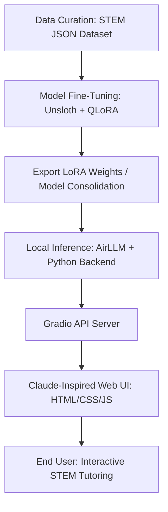

# SYNOPSIS ABSTRACT

**PROJECT TITLE:** AetherMind: Elite Computational AI Assistant and STEM Mentor  
**PROJECT TYPE:** Computer Science & Engineering (Computational Intelligence / Natural Language Processing)  
**TEAM MEMBERS:**  
1. L DHANUSH RAJ  
2. SHREYAS V  
3. HARISH MEHALA KUMAR  
**ACADEMIC YEAR:** 2025–2026  

---

## 1. ABSTRACT / OVERVIEW
**AetherMind** is a domain-specialized, local-first Computational AI Assistant and STEM Mentor designed to provide high-precision, step-by-step guidance in Mathematics, Statistics, Computer Science, Coding, Web Development, and Cybersecurity. Standard LLMs often struggle with mathematical accuracy, require persistent high-speed internet, carry high API operational costs, and pose privacy concerns. To resolve these challenges, AetherMind integrates a fine-tuned, quantized Small Language Model (SLM)—specifically **Gemma-2-2B/7B**—trained using Parameter-Efficient Fine-Tuning (PEFT/QLoRA) via the **Unsloth** framework, running entirely on consumer-grade local hardware.

The frontend is a Claude-inspired, responsive, premium web interface built with vanilla HTML, CSS, and modern JavaScript. It features real-time mathematical formatting (via **KaTeX**), code block syntax highlighting (via **Highlight.js**), optical character recognition (OCR via **Tesseract.js** for image queries), and dynamic visual features (particle networks). The backend uses **AirLLM** (Layer-by-Layer Execution) and **Gradio** to allow model execution on low-resource machines without exceeding VRAM capacities.

---

## 2. INTRODUCTION & PROBLEM DEFINITION
In modern academic and professional computer science settings, students and developers rely heavily on AI assistants (like ChatGPT or Claude) to debug code, explain mathematical theorems, and verify algorithmic complexities. However, these systems exhibit three core weaknesses:
1. **Hallucination in Exact Sciences:** General-purpose models frequently output incorrect calculations, approximate algebraic steps, or generate code with subtle logic errors.
2. **Privacy & Infrastructure Dependence:** Running cloud-based models requires an uninterrupted internet connection and uploads proprietary code/personal queries to remote servers.
3. **High Resource/Financial Cost:** Accessing premium reasoning models requires monthly subscriptions or API tokens, which is unsustainable for students.

AetherMind addresses this by creating a localized, highly specialized LLM pipeline. By restricting the training corpus to structured STEM datasets containing mathematical derivations, CS proofs, and secure coding patterns, AetherMind achieves superior domain-specific performance while utilizing a model compact enough to run locally.

---

## 3. OBJECTIVES OF THE PROJECT
*   **Domain Specialization:** Fine-tune a lightweight base model (Gemma-2-2B/7B) to achieve high-accuracy responses in mathematical derivations and code generation.
*   **Local & Secure Execution:** Implement a local inference backend using AirLLM to run models with 2B–7B parameters on consumer laptops with as little as 4GB-8GB VRAM.
*   **Premium Interactive User Interface:** Construct a responsive, visually engaging web dashboard featuring a dark/light mode, particle background, chat history preservation, and layout transitions.
*   **Rich Formatting Engine:** Integrate Markdown parsing, KaTeX mathematical notation rendering, and syntax-highlighted code blocks with one-click copy and session export (PDF, Word, Markdown) functions.
*   **Multimodal Input Processing:** Provide OCR capabilities to allow users to upload handwritten math equations or code screenshots and receive step-by-step explanations.

---

## 4. SYSTEM METHODOLOGY
The development of AetherMind is structured into three primary phases:

1.  **Phase 1: Dataset Curation and Fine-Tuning:** A specialized dataset of structured instructions, inputs, and step-by-step outputs covering mathematics, coding, and security was compiled. Using **Unsloth QLoRA**, the Gemma-2-2B base model was fine-tuned in 4-bit quantization, lowering the required training VRAM to under 6GB on a single NVIDIA T4 GPU.
2.  **Phase 2: Backend & Inference Layer:** The fine-tuned weights are loaded locally using **AirLLM**. AirLLM splits the model layers and executes them sequentially, enabling the execution of 7B-parameter models on extremely low VRAM configurations. A Python-based **Gradio** script exposes this model via an API endpoint.
3.  **Phase 3: Web Client Integration:** A responsive frontend connects to the local Gradio API. It processes the model output and renders LaTeX mathematical syntax into readable equations and code snippets into highlighted blocks, complete with export utilities.

---

## 5. HARDWARE & SOFTWARE REQUIREMENTS

### Hardware Requirements
*   **CPU:** Multi-core Intel Core i5/i7 (10th Gen or newer) or AMD Ryzen 5/7.
*   **RAM:** 16 GB DDR4/DDR5 system memory.
*   **GPU:** NVIDIA GPU with CUDA support (GTX 1660 / RTX 3050 or higher with 4GB+ VRAM for inference; 16GB VRAM or Google Colab T4 GPU for training).
*   **Storage:** 50 GB available SSD space (for model checkpoints and environment).

### Software Requirements
*   **Operating System:** Windows 10/11 (64-bit), macOS, or Linux.
*   **Development Environment:** Python 3.10+, Node.js (optional), VS Code / Jupyter Notebooks.
*   **Core Libraries:** PyTorch, Hugging Face Transformers, Unsloth, TRL, Gradio, AirLLM.
*   **Frontend Technologies:** HTML5, CSS3, JavaScript (ES6+), KaTeX (Math), Highlight.js (Code), Tesseract.js (OCR).

---

## 6. EXPECTED OUTCOMES
*   A fully functional, local AI chatbot capable of solving complex algebraic equations, explaining operating systems concepts, writing secure code, and analyzing network protocols.
*   A responsive web client that mirrors modern enterprise AI applications (like Claude or ChatGPT) with customizable server endpoints and local storage history.
*   High-fidelity rendering of equations and code blocks with formatting that matches textbook standards.
*   Exportable study materials generated directly from tutoring sessions.
